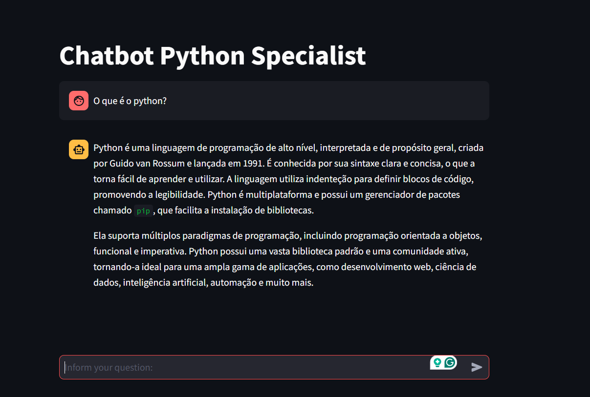

# Conversational AI Chatbot with LangChain, FAISS, and Azure OpenAI

## Overview

This project demonstrates a **Conversational AI chatbot** built using **LangChain**, **FAISS**, and **Azure OpenAI**. The chatbot utilizes a retrieval-augmented generation (RAG) architecture, allowing it to provide accurate and context-aware responses. The conversation history is maintained across user interactions using **Streamlit**.



## Features

- **Retrieval-Augmented Generation (RAG):** Combines vector search with large language models for precise responses.
- **FAISS Integration:** Utilizes FAISS for efficient similarity search and embedding storage.
- **Azure OpenAI Integration:** Leverages the power of OpenAI's GPT models hosted on Azure.
- **Streamlit Session History:** Maintains conversational context for an improved user experience.
- **Dynamic Document Ingestion:** Supports adding documents to the knowledge base for enhanced chatbot capabilities.

---

## Prerequisites

1. **Azure OpenAI Service**: Ensure you have an active Azure account with the OpenAI service enabled and a model deployed.
2. **Python Environment**: Python 3.8 or higher is required.
3. **API Keys**: Retrieve the API key and endpoint from your Azure OpenAI resource.

---

## Installation

1. **Clone the Repository**:
   ```bash
   git clone https://github.com/your-repo/chat-rag-azure-openai.git
   cd chat-rag-azure-openai
   ```

2. **Set Up a Virtual Environment**:
   ```bash
   python -m venv venv
   source venv/bin/activate # On Windows, use `venv\Scripts\activate`
   ```

3. **Install Dependencies**:
   ```bash
   pip install -r requirements.txt
   ```

4. **Configure Environment Variables**:
   Create a `.env` file and add the following:
   ```
   AZURE_OPENAI_KEY=your_api_key
   AZURE_OPENAI_ENDPOINT=https://your-resource-name.openai.azure.com/
   AZURE_OPENAI_DEPLOYMENT=your_deployment_name
   AZURE_OPENAI_VERSION=2023-05-15
   ```

---

## Usage

1. **Start the Streamlit Application**:
   ```bash
   streamlit run chat.py
   ```

2. **Interact with the Chatbot**:
   - Type your questions in the input field.
   - View responses in real-time.
   - Add documents to the knowledge base for richer interactions.

3. **Knowledge Base**:
   - Place your documents in the `data/` folder.
   - The chatbot uses FAISS to vectorize and store these documents for retrieval.

---

## Project Structure

```
├── chat.py                # Main Streamlit application
├── requirements.txt       # Required Python packages
├── data/                  # Folder for storing documents
├── embeddings/            # Folder for FAISS vector storage
├── README.md              # Project documentation
└── .env                   # Environment variables
```

---

## Key Technologies

- **LangChain**: Framework for building applications powered by LLMs.
- **FAISS**: Library for efficient similarity search and clustering.
- **Azure OpenAI**: Provides GPT models for natural language understanding and generation.
- **Streamlit**: Simplifies the creation of interactive web applications.

---

## Contributing

We welcome contributions! Feel free to open issues or submit pull requests to enhance this project.

---

## License

This project is licensed under the [MIT License](LICENSE).

---

## Author

Developed by [Douglas Modesto](https://github.com/dgmodesto).  

For questions or feedback, reach out via email or GitHub.